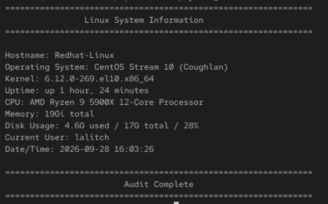

# Linux System Health & Security Audit

A hands-on Bash scripting project built on CentOS to automate Linux system health, networking, and security checks.

The project is being developed incrementally to demonstrate practical Linux administration, Bash scripting, troubleshooting, and automation skills.

## Current Status

### Completed

- System information collection script

### In Progress

- Network connectivity and configuration checks
- Linux security audit
- Combined audit tool
- Report generation
- Automation

## Current Script

### System Information

The first script, `system_info.sh`, collects:

- Hostname
- Operating system
- Kernel
- Uptime
- CPU
- Memory
- Disk usage
- Current user
- Date/time

### Example



## Repository Structure

```text
linux-system-health-security-audit/
├── README.md
├── scripts/
│   └── system_info.sh
├── documentation/
│   └── 01-system-info.md
└── screenshots/
    └── 01-system-info-output.png
```
